# Kode 系统架构设计

## 架构概览

Kode采用**三层并行架构**设计，灵感来源于Claude Code，确保系统的可扩展性、可维护性和高性能。

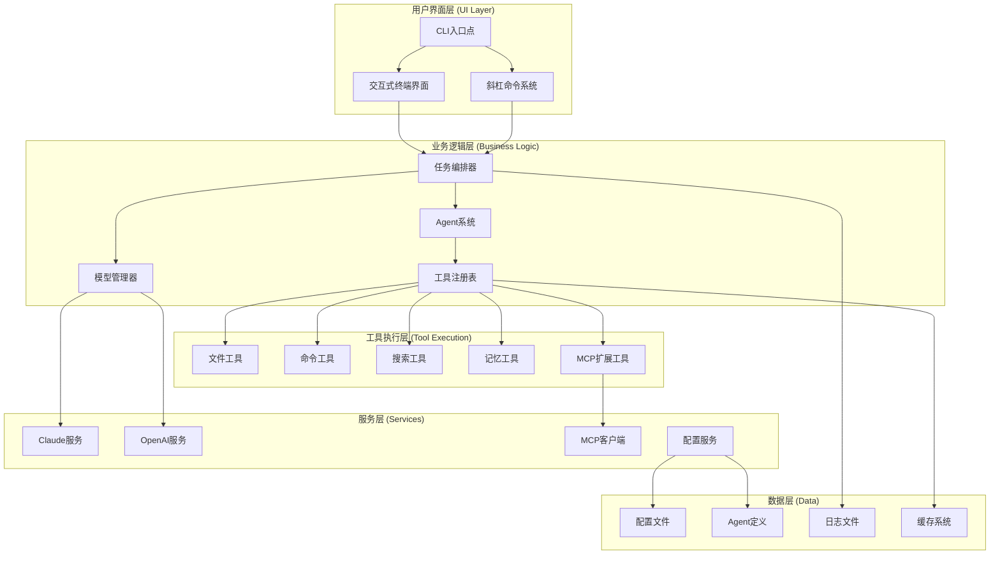

## 核心架构组件

### 1. 用户界面层

#### CLI入口点 (`src/entrypoints/cli.tsx`)
- **职责**：应用程序入口，命令行参数解析
- **功能**：
  - 初始化系统配置
  - 处理命令行参数
  - 启动相应的运行模式（交互式/非交互式）
  - 配置管理和验证

#### REPL界面 (`src/screens/REPL.tsx`)
- **职责**：交互式用户界面
- **功能**：
  - 基于Ink的React终端UI
  - 实时消息显示
  - 用户输入处理
  - 命令执行和结果显示

#### 斜杠命令系统 (`src/commands/`)
- **职责**：内置命令管理
- **功能**：
  - 命令注册和解析
  - 命令执行和权限控制
  - 帮助系统
  - 配置管理命令

### 2. 业务逻辑层

#### 任务编排器 (`src/tools/TaskTool/`)
- **职责**：任务分发和协调
- **功能**：
  - Agent选择和调用
  - 任务结果聚合
  - 错误处理和重试
  - 执行状态管理

#### Agent系统 (`src/utils/agentLoader.ts`)
- **职责**：动态Agent管理
- **功能**：
  - Agent配置加载（5层优先级）
  - Agent实例化和管理
  - Agent热重载
  - Agent协作机制

#### 模型管理器 (`src/utils/model.ts`)
- **职责**：AI模型统一管理
- **功能**：
  - 多模型配置管理
  - 模型切换和适配
  - 模型能力映射
  - 成本和性能优化

#### 工具注册表 (`src/tools.ts`)
- **职责**：工具统一管理
- **功能**：
  - 工具注册和发现
  - 工具权限验证
  - 工具执行协调
  - 工具结果处理

### 3. 工具执行层

#### 文件工具 (`src/tools/FileReadTool/`, `src/tools/FileWriteTool/`)
- **职责**：文件系统操作
- **功能**：
  - 文件读取和写入
  - 文件搜索和过滤
  - 目录操作
  - 文件权限管理

#### 命令工具 (`src/tools/BashTool/`)
- **职责**：系统命令执行
- **功能**：
  - Bash命令执行
  - 命令输出捕获
  - 错误处理
  - 超时控制

#### 搜索工具 (`src/tools/GrepTool/`)
- **职责**：代码搜索
- **功能**：
  - 正则表达式搜索
  - 文件内容匹配
  - 代码结构分析
  - 搜索结果高亮

#### 记忆工具 (`src/tools/MemoryReadTool/`, `src/tools/MemoryWriteTool/`)
- **职责**：持久化记忆管理
- **功能**：
  - 记忆存储和检索
  - 上下文管理
  - 会话状态保持
  - 知识库管理

#### MCP工具 (`src/tools/MCPOpenTool/`)
- **职责**：MCP协议集成
- **功能**：
  - 外部工具集成
  - 协议转换
  - 服务发现
  - 连接管理

## 数据流设计

### 1. 用户输入流程

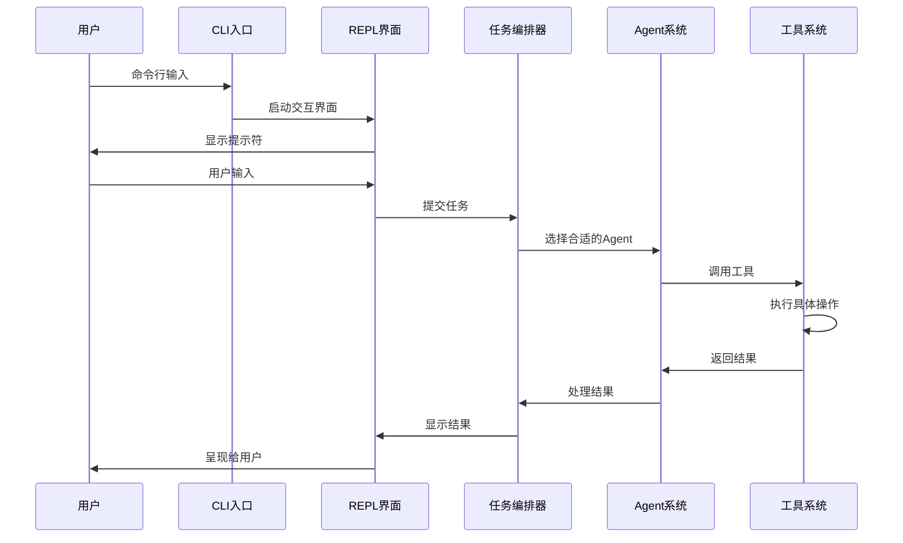

### 2. Agent协作流程

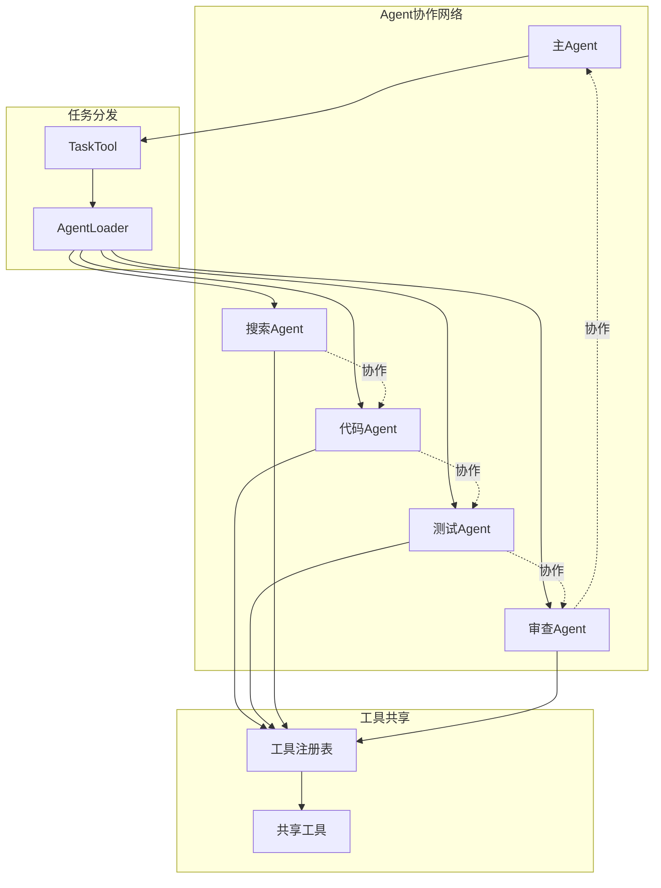

## 配置系统架构

### 1. 配置层次结构

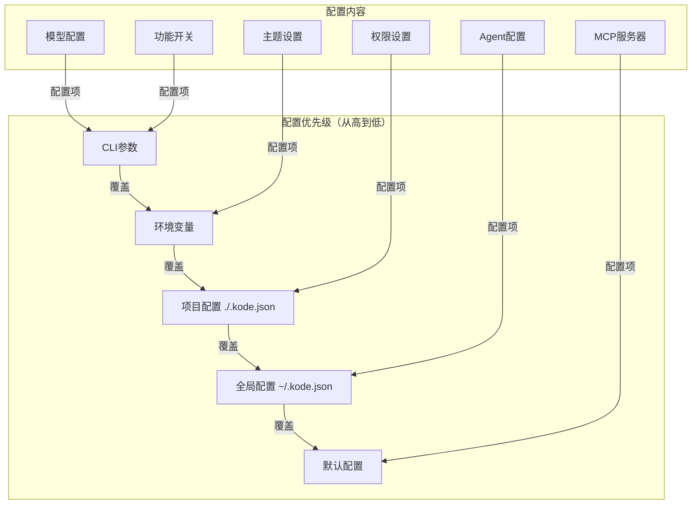

### 2. Agent配置系统

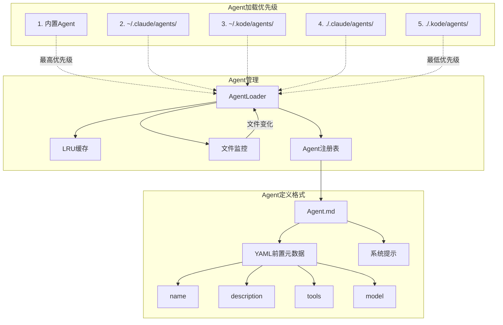

## 权限系统架构

### 1. 权限管理流程

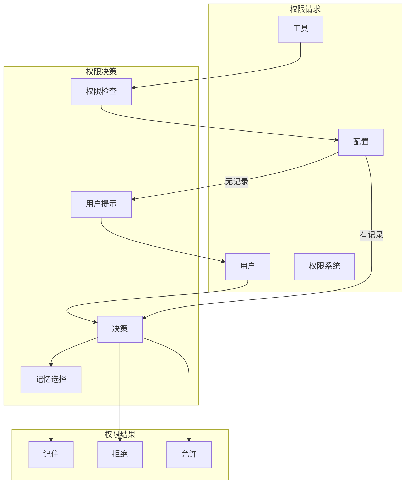

### 2. 工具权限控制

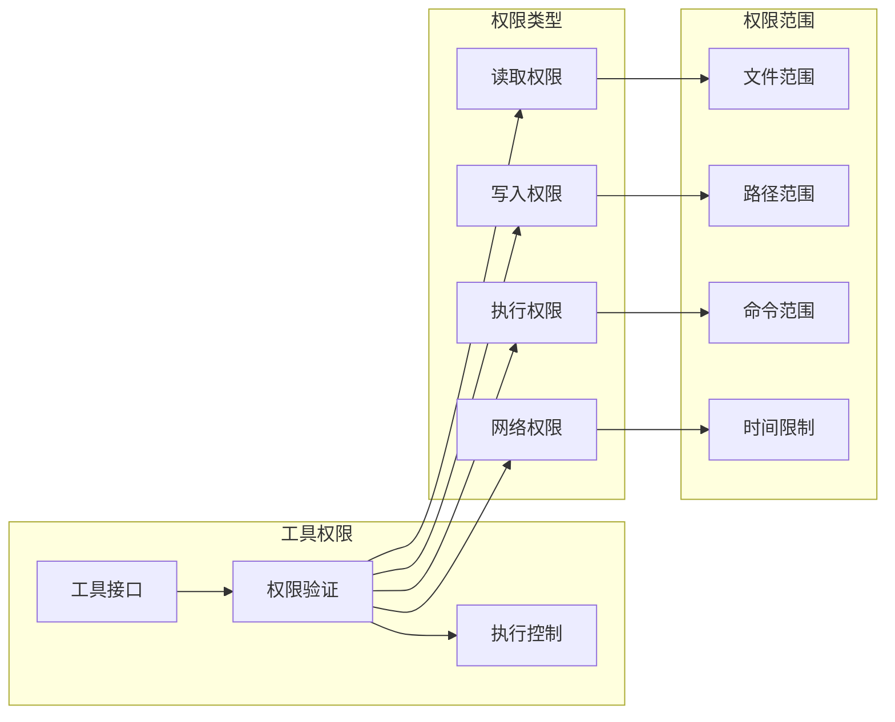

## 性能优化策略

### 1. 缓存系统

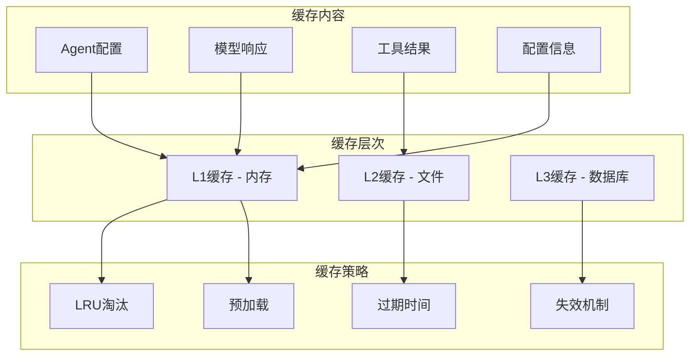

### 2. 并发处理

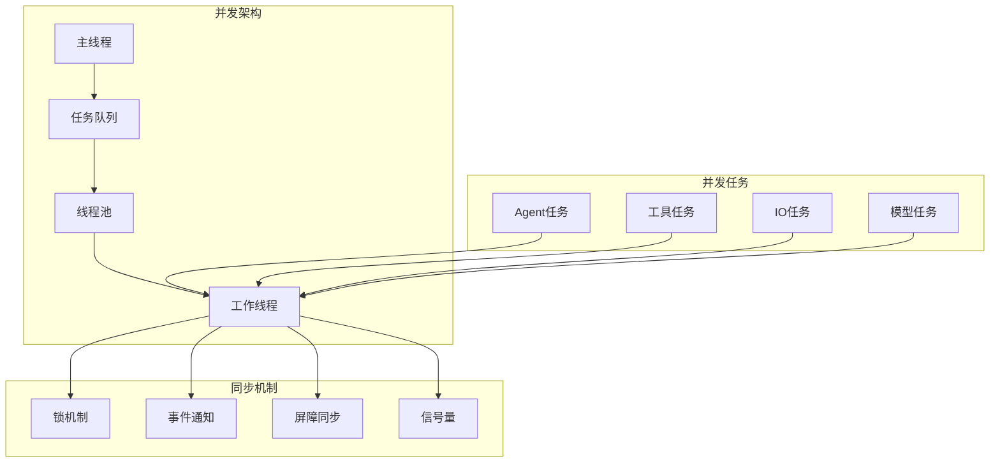

## 扩展性设计

### 1. 插件系统

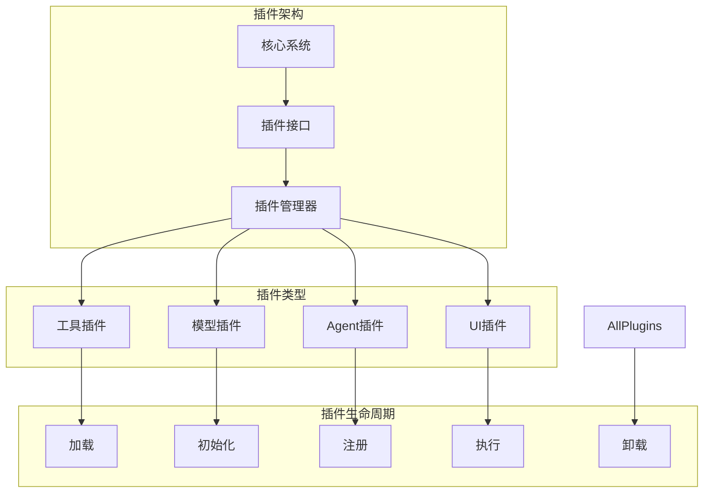

### 2. MCP集成架构

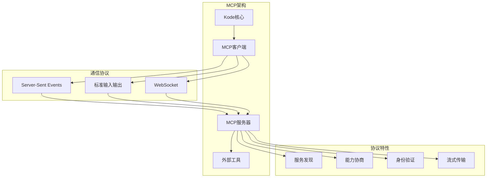

## 错误处理和恢复

### 1. 错误处理策略

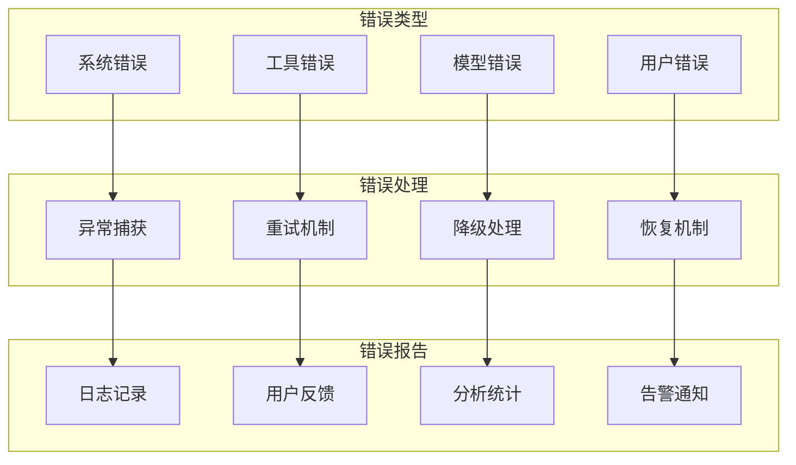

### 2. 系统恢复机制

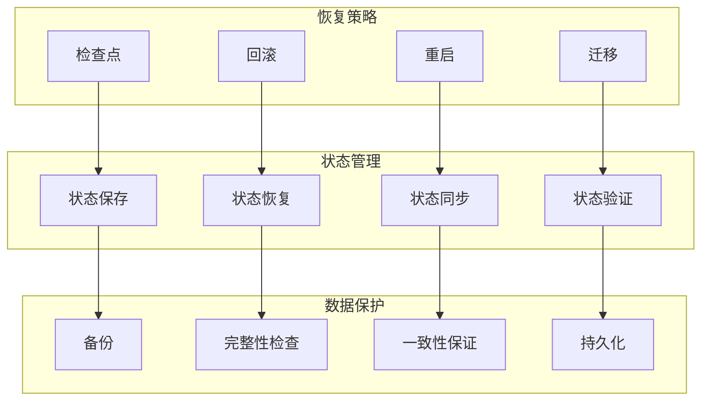

---

这个架构设计确保了Kode系统的高可用性、可扩展性和可维护性，为未来的功能扩展和性能优化奠定了坚实的基础。