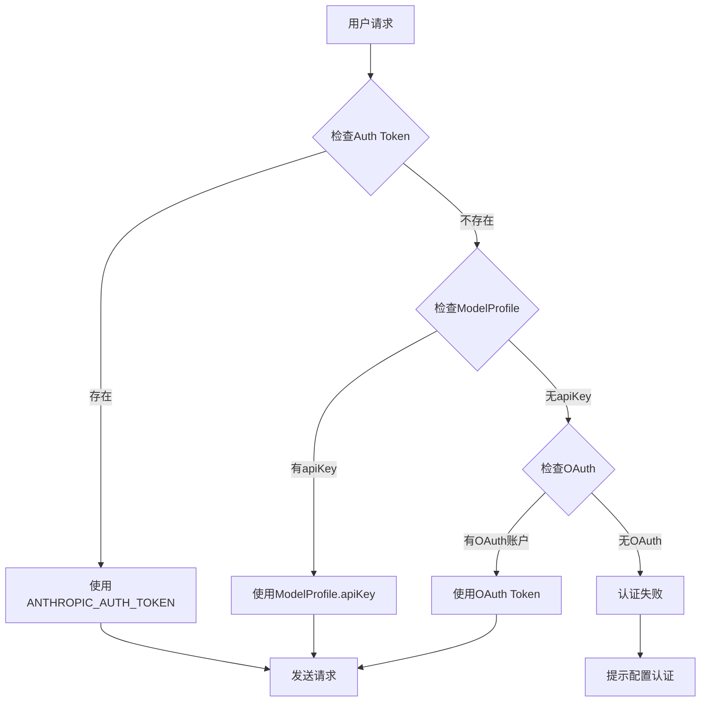

# Kode项目认证机制详解

## 概述

Kode项目支持多种认证方式来访问不同的AI服务提供商，包括Auth Token、API Key和OAuth等机制。本文档详细分析这些认证方式的实现原理、使用场景和区别。

## 认证方式概览

Kode支持以下三种主要认证方式：

1. **Auth Token认证**：通过环境变量设置的Bearer Token
2. **API Key认证**：存储在ModelProfile中的API密钥
3. **OAuth认证**：完整的OAuth 2.0授权码流程

## 1. Auth Token认证机制

### 实现原理

Auth Token认证主要通过环境变量`ANTHROPIC_AUTH_TOKEN`实现：

```typescript
// src/services/claude.ts:870-873
const defaultHeaders: { [key: string]: string } = {
  'x-app': 'cli',
  'User-Agent': USER_AGENT,
}
if (process.env.ANTHROPIC_AUTH_TOKEN) {
  defaultHeaders['Authorization'] = `Bearer ${process.env.ANTHROPIC_AUTH_TOKEN}`
}
```

### 特点

- **全局性**：影响所有Anthropic客户端实例
- **环境级别**：通过环境变量设置，进程范围内有效
- **优先级高**：在客户端初始化时直接设置到defaultHeaders
- **安全性**：不存储在配置文件中，避免泄露

### 使用场景

1. **开发环境**：开发者本地调试
2. **CI/CD环境**：自动化流程中的认证
3. **服务器部署**：生产环境统一认证
4. **临时授权**：短期测试或演示

### 设置方式

```bash
# 方式1：直接设置环境变量
export ANTHROPIC_AUTH_TOKEN=your_auth_token_here

# 方式2：在.env文件中设置
echo "ANTHROPIC_AUTH_TOKEN=your_auth_token_here" >> .env

# 方式3：运行时设置
ANTHROPIC_AUTH_TOKEN=your_token kode
```

## 2. API Key认证机制

### 实现原理

API Key认证通过ModelProfile配置实现，每个模型配置包含独立的apiKey字段：

```typescript
// ModelProfile定义
export type ModelProfile = {
  name: string
  provider: ProviderType
  modelName: string
  apiKey: string  // 存储API密钥
  // ... 其他字段
}
```

在请求时动态设置认证头：

```typescript
// src/services/claude.ts:425-462 (verifyApiKey函数)
const headers: Record<string, string> = {
  Authorization: `Bearer ${apiKey}`,
  'Content-Type': 'application/json',
}
```

### 特点

- **模型独立**：每个ModelProfile有独立的API Key
- **配置持久化**：存储在配置文件中
- **动态选择**：根据当前使用的模型自动选择对应的API Key
- **多Provider支持**：支持OpenAI、Anthropic、DeepSeek等多种服务商

### 优先级机制

```typescript
// 优先级顺序（从高到低）：
1. ANTHROPIC_AUTH_TOKEN 环境变量（全局）
2. ModelProfile.apiKey（模型特定）
3. ANTHROPIC_API_KEY 环境变量（传统方式）
```

### 使用场景

1. **多模型管理**：不同模型使用不同的API Key
2. **用户配置**：通过UI界面配置和管理
3. **项目隔离**：不同项目使用不同的认证信息
4. **细粒度控制**：精确控制每个模型的访问权限

### 设置方式

```bash
# 通过模型配置界面
kode model

# 或直接编辑配置文件
~/.claude.json
```

## 3. OAuth认证机制

### 实现原理

OAuth认证实现了完整的OAuth 2.0授权码流程：

```typescript
// OAuth服务类结构
export class OAuthService {
  // 1. 启动授权流程
  async startFlow(): Promise<{ accessToken: string }>
  
  // 2. 交换授权码获取token
  private async exchangeCodeForTokens(): Promise<OAuthTokenExchangeResponse>
  
  // 3. 使用access_token创建API Key
  async createAndStoreApiKey(accessToken: string): Promise<string | null>
}
```

#### OAuth流程详解

1. **授权请求**
   ```typescript
   // 生成PKCE参数
   const codeVerifier = generateCodeVerifier()
   const codeChallenge = await generateCodeChallenge(codeVerifier)
   const state = base64URLEncode(crypto.randomBytes(32))
   ```

2. **本地服务器**
   ```typescript
   // 启动本地服务器接收回调
   this.server = http.createServer((req, res) => {
     // 处理OAuth回调
   })
   ```

3. **Token交换**
   ```typescript
   const tokenResponse = await fetch(OAUTH_CONFIG.TOKEN_URL, {
     method: 'POST',
     headers: { 'Content-Type': 'application/x-www-form-urlencoded' },
     body: tokenParams
   })
   ```

4. **API Key创建**
   ```typescript
   const createApiKeyResp = await fetch(OAUTH_CONFIG.API_KEY_URL, {
     method: 'POST',
     headers: { Authorization: `Bearer ${accessToken}` },
   })
   ```

### OAuth配置

```typescript
// src/constants/oauth.ts
const OAUTH_CONFIG = {
  REDIRECT_PORT: 54545,
  SCOPES: ['org:create_api_key', 'user:profile'],
  // ... 其他配置
}
```

### 特点

- **标准协议**：遵循OAuth 2.0标准
- **安全性高**：使用PKCE扩展防止授权码截获
- **用户友好**：通过浏览器完成授权
- **自动管理**：自动处理token刷新和API Key创建

### 使用场景

1. **企业用户**：组织级别的认证管理
2. **安全要求高**：需要严格权限控制的环境
3. **多用户系统**：需要区分不同用户的访问权限
4. **官方推荐**：Anthropic官方推荐的认证方式

## 认证方式对比

| 特性 | Auth Token | API Key | OAuth |
|------|------------|---------|-------|
| **设置复杂度** | 简单 | 中等 | 复杂 |
| **安全级别** | 高 | 中等 | 最高 |
| **适用场景** | 开发/CI | 多模型管理 | 企业/生产 |
| **存储位置** | 环境变量 | 配置文件 | 配置文件+Token |
| **多模型支持** | 全局 | 独立 | 独立 |
| **权限粒度** | 全局 | 模型级 | 用户级 |
| **自动刷新** | 手动 | 手动 | 自动 |

## 认证流程图



## 实际使用示例

### 1. 开发环境快速配置

```bash
# 设置Auth Token（推荐用于开发）
export ANTHROPIC_AUTH_TOKEN=sk-ant-xxx
kode
```

### 2. 生产环境多模型配置

```bash
# 配置多个模型的API Key
kode model
# 在UI中添加：
# - Claude Sonnet (Anthropic): sk-ant-xxx
# - GPT-4 (OpenAI): sk-xxx
# - DeepSeek (DeepSeek): sk-xxx
```

### 3. 企业环境OAuth配置

```bash
# 启动OAuth流程
kode oauth
# 浏览器中完成授权
# 系统自动创建和管理API Key
```

## 最佳实践

### 1. 安全性建议

- **生产环境**：优先使用OAuth认证
- **开发环境**：使用Auth Token环境变量
- **多模型场景**：使用API Key配置
- **敏感信息**：避免在代码中硬编码认证信息

### 2. 配置管理

```bash
# 开发环境
export ANTHROPIC_AUTH_TOKEN=your_dev_token

# 生产环境使用配置文件
~/.claude.json:
{
  "modelProfiles": [
    {
      "name": "Claude Sonnet",
      "apiKey": "sk-ant-xxx",
      "provider": "anthropic"
    }
  ],
  "oauthAccount": {
    "accountUuid": "xxx",
    "emailAddress": "user@company.com"
  }
}
```

### 3. 故障排除

```bash
# 检查认证状态
kode model  # 查看模型配置
env | grep ANTHROPIC  # 检查环境变量

# 测试连接
kode test-connection  # 测试当前认证是否有效
```

## 源码结构

```
src/
├── services/
│   ├── claude.ts           # Claude客户端和Auth Token处理
│   ├── oauth.ts            # OAuth 2.0流程实现
│   └── openai.ts           # OpenAI等其他Provider的认证
├── constants/
│   └── oauth.ts            # OAuth配置常量
├── utils/
│   └── config.ts           # ModelProfile和配置管理
└── components/
    ├── ConsoleOAuthFlow.tsx # OAuth UI组件
    └── ModelConfig.tsx     # 模型配置界面
```

## 扩展性

Kode的认证系统设计具有良好的扩展性：

### 1. 新Provider集成

```typescript
// 添加新的Provider类型
export type ProviderType = 
  | 'anthropic' 
  | 'openai' 
  | 'your-new-provider'  // 新增

// 在ModelProfile中支持新Provider
const profile: ModelProfile = {
  name: 'My Custom Model',
  provider: 'your-new-provider',
  apiKey: 'your-api-key',
  // ...
}
```

### 2. 认证方式扩展

```typescript
// 可以扩展支持其他认证方式
interface AuthConfig {
  type: 'api-key' | 'oauth' | 'auth-token' | 'custom'
  credentials: Record<string, any>
}
```

## 总结

Kode的认证机制通过三种不同的认证方式，满足了从开发到生产的各种场景需求：

1. **Auth Token**：简单快速，适合开发和CI环境
2. **API Key**：灵活可控，适合多模型管理场景  
3. **OAuth**：安全标准，适合企业和生产环境

这种多层次的认证架构为用户提供了最大的灵活性，同时保证了不同场景下的安全性需求。通过统一的ModelProfile管理和智能的优先级机制，Kode能够无缝地在不同认证方式之间切换，为用户提供流畅的多模型体验。